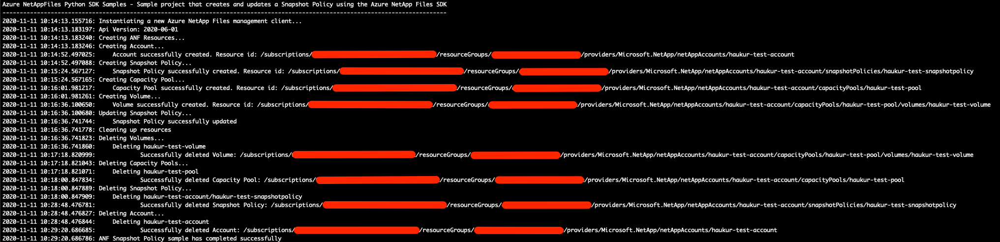

# Azure NetAppFiles Snapshot Policy SDK Sample for Python

This project demonstrates how to use a Python sample application to create and update a Snapshot Policy for the Microsoft.NetApp resource provider. 

In this sample application we perform the following operations:

- Creation
  - ANF Account
  - Snapshot Policy
  - Capacity Pool
  - Volume
- Updates
  - Snapshot Policy
- Deletions
  - Volume
  - Capacity Pool
  - Snapshot Policy
  - ANF Account
			
If you don't already have a Microsoft Azure subscription, you can get a FREE trial account [here](http://go.microsoft.com/fwlink/?LinkId=330212).

## Prerequisites

1. Python (code was built and tested using version 3.9.5)
2. Azure Subscription
3. Subscription needs to be enabled for Azure NetApp Files. For more information, please refer to [this](https://docs.microsoft.com/azure/azure-netapp-files/azure-netapp-files-register#waitlist) document.
4. Resource Group created
5. Virtual Network with a delegated subnet to Microsoft.Netapp/volumes resource. For more information, please refer to [Guidelines for Azure NetApp Files network planning](https://docs.microsoft.com/en-us/azure/azure-netapp-files/azure-netapp-files-network-topologies)
6. For this sample Python console application to work we need to authenticate, and the chosen method for this sample is using service principals.
   1. Within an [Azure Cloud Shell](https://docs.microsoft.com/en-us/azure/cloud-shell/quickstart) session, make sure you're logged on at the subscription where you want to be associated with the service principal by default:
        ```bash
        az account show
        ```
   
        If this is not the correct subscription, use:
   
        ```bash
        az account set -s <subscription name or id>  
        ```

    2. Create a service principal using Azure CLI
   
        ```bash
        az ad sp create-for-rbac --sdk-auth
        ```
       >Note: this command will automatically assign RBAC contributor role to the service principal at subscription level, you can narrow down the scope to the specific resource group where your tests will create the resources.

    3. Copy the output content and paste it in a file called azureauth.json and secure it with file system permissions
    4. Set an environment variable pointing to the file path you just created, here is an example with Powershell and bash:
            
        Powershell
   
        ```powershell
        [Environment]::SetEnvironmentVariable("AZURE_AUTH_LOCATION", "C:\sdksample\azureauth.json", "User")
        ```
        Bash

        ```bash
        export AZURE_AUTH_LOCATION=/sdksamples/azureauth.json
        ```
        >Note: for other Azure Active Directory authentication methods for Python, please refer to these [samples](https://github.com/AzureAD/microsoft-authentication-library-for-python/tree/dev/sample). 

# What is example.py doing? 

This sample project is dedicated to demonstrate how to create and update a Snapshot Policy in Azure NetApp Files for a NFS v4.1 enabled volume. Similar to other examples, the authentication method is based on a service principal.
This project will first create an ANF Account and then a Snapshot Policy that is tied to that Account. Afterwards it will create a Capacity Pool within the Account and finally a single Volume that uses the newly created Snapshot Policy. 

A Snapshot Policy uses schedules to create snapshots of Volumes that can be **hourly**, **daily**, **weekly**, **monthly**. The Snapshot Policy will also determine how many snapshots to keep.
The sample will create a Snapshot Policy with all schedules and then update a single schedule within the policy, changing the value of the schedule's snapshots to keep.

Finally, all created resources will be deleted via the cleanup process (as long as the appropriate variable in example.py has been set to 'True').

# Contents

| File/folder                 | Description                                                                                                      |
|-----------------------------|------------------------------------------------------------------------------------------------------------------|
| `media\`                    | Folder that contains a screenshot of a successful run.                                                           |
| `src\`                      | Sample source code folder.                                                                                       |
| `src\example.py`            | Sample main file that executes all operations.                                                                   |
| `src\sample_utils.py`       | Sample file that contains authentication functions, all wait functions and other small functions.                |
| `src\resource_uri_utils.py` | Sample file that contains functions to work with URIs, e.g. get resource name from URI (`get_anf_capacitypool`). |
| `src\requirements.txt`      | Sample script required modules.                                                                                  |

# How to run the script

1. Clone it locally
    ```powershell
    git clone https://github.com/Azure-Samples/netappfiles-python-snapshot-policy-sdk-sample.git
    ```
1. Change folder to **.\netappfiles-python-snapshot-policy-sdk-sample\src**
2. Install any missing dependencies as needed
    ```bash
    pip install -r ./requirements.txt
    ```
    or upgrade dependencies if they already exist
    ```bash
    pip install --upgrade -r ./requirements.txt
    ```
3. Make sure you have the azureauth.json and its environment variable with the path to it defined (as previously described at [prerequisites](#Prerequisites))
4. Edit file **example.py** and change the variables contents as appropriate (names are self-explanatory).
5. Run the script
    ```powershell
    python example.py
    ```

Sample output
 

# References

- [Azure NetAppFiles SDK Sample for Python](https://docs.microsoft.com/en-us/samples/azure-samples/netappfiles-python-sdk-sample/azure-netappfiles-sdk-sample-for-python/)
- [Azure Active Directory Python Authentication samples](https://github.com/AzureAD/microsoft-authentication-library-for-python/tree/dev/sample)
- [Resource limits for Azure NetApp Files](https://docs.microsoft.com/en-us/azure/azure-netapp-files/azure-netapp-files-resource-limits)
- [Azure Cloud Shell](https://docs.microsoft.com/en-us/azure/cloud-shell/quickstart)
- [Azure NetApp Files documentation](https://docs.microsoft.com/en-us/azure/azure-netapp-files/)
- [Download Azure SDKs](https://azure.microsoft.com/downloads/) 
 
